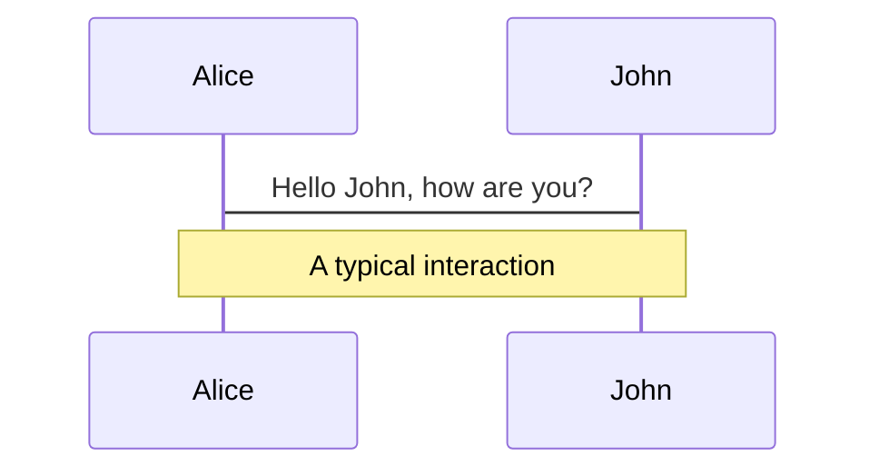
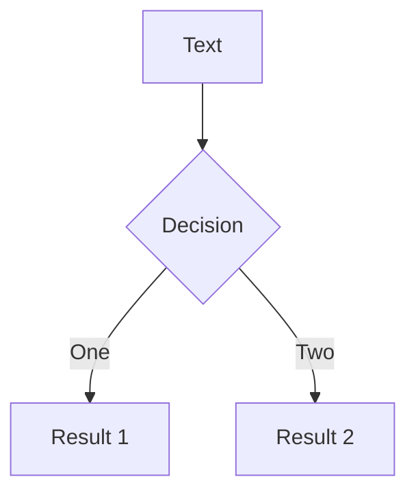
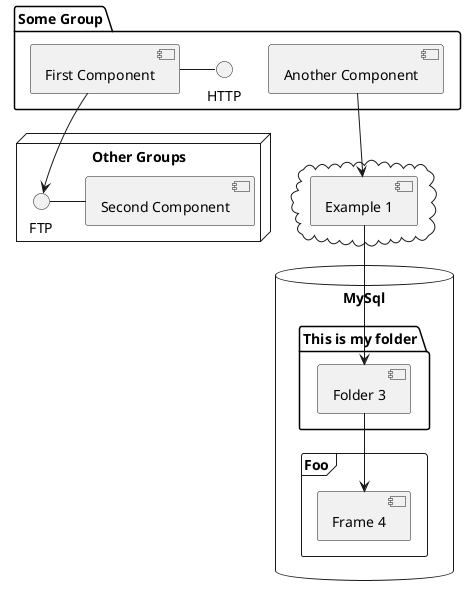

# CSS Grids

<div class="abs-br m-6 flex gap-2">
  <a href="https://github.com/samyakahuja/css-grid-slides" target="_blank" alt="GitHub"
    class="text-xl icon-btn !border-none !hover:text-white">
    <carbon-logo-github />
  </a>
</div>

---

# Browser Support

- according to [caniuse](https://caniuse.com/css-grid) **95%** of tracked
  desktop traffic uses a browser that supports css grids.
- IE 11 also supports css grids, but an older verson of the spec. For seeing
  what differences are there, there's a great article from
  [css-tricks](https://css-tricks.com/css-grid-in-ie-debunking-common-ie-grid-misconceptions/)
- if you are not sure, then provide a base style, and then add additional css
  for browsers that support css grids

  ```css
  .wrapper {
    display: flex;
  }

  @supports (display: grid) {
    .wrapper {
      display: grid;
    }
  }
  ```

  <span class="text-sm opacity-50">
    Note: IE 11 does not support `@supports` keyword, hence the styles
    inside it are automatically ignored.
  </span>

---
layout: center
class: "text-center"
---

# Tenets of css grids

Rules to keep in mind before delving into the details

---
layout: center
class: "text-center"
---

- All the cells in a column should have equal width.

<figure>

<figcaption class="text-sm opacity-70 mt-2">This is a valid grid where all the cells in the column are 250px
</figcaption>
</figure>


<style>
  * {
    box-sizing: border-box;
  }

  figure {
    width: min-content;
    padding: 16px;
    margin: 0 auto;
  }

  figure img {
    width: 250px;
    max-width: revert;
  }
</style>

---
layout: center
class: "text-center"
---

- All the cells in a row should have equal height.

<figure>

<figcaption class="text-sm opacity-70 mt-2">This is a valid grid where all the cells in a row are equal height (even though all the rows are of different height)</figcaption>
</figure>


<style>
  * {
    box-sizing: border-box;
  }

  figure {
    width: min-content;
    padding: 16px;
    margin: 0 auto;
  }

  figure img {
    width: 250px;
    max-width: revert;
  }
</style>

---
layout: center
class: "text-center"
---

- Each column needs to have same number of rows (cells).
- Each row needs to have same number of columns (cells).

<figure>

<figcaption class="text-sm opacity-70 mt-2">This in a invalid grid since the first row has 1 column and second row has 2 columns.</figcaption>
</figure>

<style>
  * {
    box-sizing: border-box;
  }

  figure {
    width: min-content;
    padding: 16px;
    margin: 0 auto;
  }

  figure img {
    width: 250px;
    max-width: revert;
  }
</style>

---

# Takeaways

<br>

<p class="text-center ">
With CSS Grid the structure happens exclusively in CSS. There are no DOM nodes
that represent the rows or columns in CSS Grid. Instead, the rows and columns
are invisible markers, tools that our HTML elements can use to position
themselves.
</p>

<br>

<p class="text-center">
Rows and columns are like the lines painted on the ground in parking lots.
Drivers can use these lines to align their vehicles, but really they're just
symbols. It's up to the driver to decide how to use them.
</p>

---

# Components

<div grid="~ cols-2 gap-4">
<div>

You can use Vue components directly inside your slides.

We have provided a few built-in components like `<Tweet/>` and `<Youtube/>` that you can use directly. And adding your custom components is also super easy.

```html
<Counter :count="10" />
```

<!-- ./components/Counter.vue -->
<Counter :count="10" m="t-4" />

Check out [the guides](https://sli.dev/builtin/components.html) for more.

</div>
<div>

```html
<Tweet id="1390115482657726468" />
```

<Tweet id="1390115482657726468" scale="0.65" />

</div>
</div>

---

## class: px-20

# Themes

Slidev comes with powerful theming support. Themes can provide styles, layouts, components, or even configurations for tools. Switching between themes by just **one edit** in your frontmatter:

<div grid="~ cols-2 gap-2" m="-t-2">

```yaml
---
theme: default
---
```

```yaml
---
theme: seriph
---
```


</div>

Read more about [How to use a theme](https://sli.dev/themes/use.html) and
check out the [Awesome Themes Gallery](https://sli.dev/themes/gallery.html).

---

## preload: false

# Animations

Animations are powered by [@vueuse/motion](https://motion.vueuse.org/).

```html
<div v-motion :initial="{ x: -80 }" :enter="{ x: 0 }">Slidev</div>
```

<div class="w-60 relative mt-6">
  <div class="relative w-40 h-40">
    
    
    
  </div>

  <div
    class="text-5xl absolute top-14 left-40 text-[#2B90B6] -z-1"
    v-motion
    :initial="{ x: -80, opacity: 0}"
    :enter="{ x: 0, opacity: 1, transition: { delay: 2000, duration: 1000 } }">
    Slidev
  </div>
</div>

<!-- vue script setup scripts can be directly used in markdown, and will only affects current page -->
<script setup lang="ts">
const final = {
  x: 0,
  y: 0,
  rotate: 0,
  scale: 1,
  transition: {
    type: 'spring',
    damping: 10,
    stiffness: 20,
    mass: 2
  }
}
</script>

<div
  v-motion
  :initial="{ x:35, y: 40, opacity: 0}"
  :enter="{ y: 0, opacity: 1, transition: { delay: 3500 } }">

[Learn More](https://sli.dev/guide/animations.html#motion)

</div>

---

# LaTeX

LaTeX is supported out-of-box powered by [KaTeX](https://katex.org/).

<br>

Inline $\sqrt{3x-1}+(1+x)^2$

Block

$$
\begin{array}{c}

\nabla \times \vec{\mathbf{B}} -\, \frac1c\, \frac{\partial\vec{\mathbf{E}}}{\partial t} &
= \frac{4\pi}{c}\vec{\mathbf{j}}    \nabla \cdot \vec{\mathbf{E}} & = 4 \pi \rho \\

\nabla \times \vec{\mathbf{E}}\, +\, \frac1c\, \frac{\partial\vec{\mathbf{B}}}{\partial t} & = \vec{\mathbf{0}} \\

\nabla \cdot \vec{\mathbf{B}} & = 0

\end{array}
$$

<br>

[Learn more](https://sli.dev/guide/syntax#latex)

---

# Diagrams

You can create diagrams / graphs from textual descriptions, directly in your Markdown.

<div class="grid grid-cols-3 gap-10 pt-4 -mb-6">







</div>

[Learn More](https://sli.dev/guide/syntax.html#diagrams)

---

layout: center
class: text-center

---

# Learn More

[Documentations](https://sli.dev) · [GitHub](https://github.com/slidevjs/slidev) · [Showcases](https://sli.dev/showcases.html)
